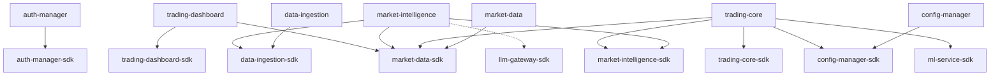

# DESIGN — CricoAI v2

## 1. Architecture Overview

### 1.1 Vision

A modular Rust backend (cyberfabric-core) serving a React 19 frontend (HAI3), with Python retained only for ML inference via gRPC. All modules follow cyberfabric-core's ModKit patterns: SDK trait separation, SecureConn DB access, DNA-compliant REST APIs, and lifecycle management for background services.

### 1.2 Drivers

| Driver | Type | Addressed By |
|--------|------|-------------|
| Type-safe module boundaries | FR | SDK pattern, ClientHub, Rust compiler |
| Tenant-scoped data isolation | NFR | SecureConn + AccessScope (ADR-0001) |
| DNA-compliant REST API | NFR | OperationBuilder + OData + RFC 9457 (ADR-0003) |
| ML stays in Python | Constraint | SDK-only gRPC crate (ADR-0002) |
| Real-time frontend updates | FR | SSE via ModKit SSE support |
| Observability | NFR | OpenTelemetry + Jaeger (replaces ELK) |
| Container reduction (15+ → 4) | Goal | All Rust modules in single cyberfabric-core process |

### 1.3 Requirements Mapping

| PRD Requirement | Addressed By (Component) |
|----------------|--------------------------|
| `cpt-cf-cricoai-fr-trading-stats` | `cpt-cf-cricoai-component-trading-dashboard` |
| `cpt-cf-cricoai-fr-model-metrics` | `cpt-cf-cricoai-component-trading-dashboard` |
| `cpt-cf-cricoai-fr-agent-analytics` | `cpt-cf-cricoai-component-trading-dashboard` |
| `cpt-cf-cricoai-fr-config-crud` | `cpt-cf-cricoai-component-config-manager` |
| `cpt-cf-cricoai-fr-pair-management` | `cpt-cf-cricoai-component-config-manager` |
| `cpt-cf-cricoai-fr-user-management` | `cpt-cf-cricoai-component-auth-manager` |
| `cpt-cf-cricoai-fr-kline-collection` | `cpt-cf-cricoai-component-market-data` |
| `cpt-cf-cricoai-fr-price-sse` | `cpt-cf-cricoai-component-market-data` |
| `cpt-cf-cricoai-fr-sentiment-analysis` | `cpt-cf-cricoai-component-market-intelligence` |
| `cpt-cf-cricoai-fr-agent-decision-sse` | `cpt-cf-cricoai-component-market-intelligence` |
| `cpt-cf-cricoai-fr-data-ingestion` | `cpt-cf-cricoai-component-data-ingestion` |
| `cpt-cf-cricoai-fr-trading-loop` | `cpt-cf-cricoai-component-trading-core` |
| `cpt-cf-cricoai-fr-trading-control` | `cpt-cf-cricoai-component-trading-core` |
| `cpt-cf-cricoai-fr-trade-event-sse` | `cpt-cf-cricoai-component-trading-core` |
| `cpt-cf-cricoai-fr-ml-grpc-bridge` | `cpt-cf-cricoai-component-ml-service-sdk` |
| `cpt-cf-cricoai-nfr-dna-compliance` | All modules via `cpt-cf-cricoai-principle-dna-rest` |
| `cpt-cf-cricoai-nfr-trading-parity` | `cpt-cf-cricoai-component-trading-core` |
| `cpt-cf-cricoai-interface-sdk-traits` | All `cpt-cf-cricoai-component-*` modules via `cpt-cf-cricoai-principle-sdk-pattern` |
| `cpt-cf-cricoai-interface-rest-api` | All modules via `cpt-cf-cricoai-principle-dna-rest` |
| `cpt-cf-cricoai-contract-ml-grpc` | `cpt-cf-cricoai-component-ml-service-sdk` |

### 1.4 System Topology

```
┌─────────────────────────────────────────────────────────┐
│                    HAI3 Frontend                         │
│  React 19 + TypeScript + @hai3/uikit + Tailwind         │
│                                                         │
│  Screensets:                                            │
│   ├─ TradingScreenset (stats, open orders, P&L)        │
│   ├─ ModelsScreenset (training, calibration, regime)   │
│   ├─ AgentsScreenset (decisions, sentiment, LLM usage) │
│   ├─ SettingsScreenset (config, pairs, system)         │
│   ├─ PerformanceScreenset (alerts, strategy compare)   │
│   └─ AdminScreenset (users, roles, audit, IP blocks)   │
│                                                         │
│  API Layer: @hai3/api → RestProtocol → cyberfabric API │
│  State: @hai3/state event bus → Redux slices            │
│  Auth: JWT via @hai3/framework auth plugin              │
└────────────────────┬────────────────────────────────────┘
                     │ REST (JSON) + SSE (real-time)
                     │
┌────────────────────┴────────────────────────────────────┐
│              cyberfabric-core Server (Rust)              │
│                                                         │
│  System Modules (built-in):                             │
│   ├─ api-gateway (Axum, CORS, rate limiting, OpenAPI)  │
│   ├─ modkit-auth (JWT/OIDC validation, route policies) │
│   ├─ module-orchestrator (lifecycle management)         │
│   └─ OpenTelemetry (tracing, metrics, logging)         │
│                                                         │
│  CricoAI Modules (7):                                   │
│   ├─ trading-dashboard   [db, rest]                    │
│   ├─ config-manager      [db, rest]                    │
│   ├─ auth-manager        [db, rest]                    │
│   ├─ market-data         [db, stateful]                │
│   ├─ market-intelligence [db, rest, stateful]          │
│   ├─ data-ingestion      [db, stateful]                │
│   └─ trading-core        [db, rest, stateful]          │
│                                                         │
│  Built-in Capabilities Used:                            │
│   ├─ llm-gateway (local/external LLM provider)         │
│   ├─ ClientHub (type-safe inter-module communication)  │
│   ├─ SecureConn (tenant-scoped DB via AccessScope)     │
│   └─ SSE (real-time event broadcasting)                │
└────────────────────┬────────────────────────────────────┘
                     │ gRPC (protobuf)
                     │
┌────────────────────┴────────────────────────────────────┐
│           Python ML Service (OoP via gRPC)              │
│                                                         │
│  ml-service:                                            │
│   ├─ PredictionSystem (sklearn, XGBoost, LightGBM)     │
│   ├─ TechnicalIndicators (ta-lib, ta)                  │
│   ├─ UnifiedTrainer (walk-forward validation)          │
│   └─ MarketRegimeDetector                              │
└────────────────────┬────────────────────────────────────┘
                     │
              PostgreSQL 16
    ┌────────────────┼────────────────┐
    │                │                │
  Binance        BinanceTN      Binance_Klines
  (tenant:prod)  (tenant:test)  + Model_Data
```

**Container count: 15+ → 4** (cyberfabric-core server, ml-service, postgres, jaeger)

## 2. Principles & Constraints

### 2.1 Design Principles

1. **SDK pattern is mandatory** — Every module has `<module>-sdk` (trait + models + errors, no serde) and `<module>` (implementation). Consumers depend only on SDK crates.

**ID**: `cpt-cf-cricoai-principle-sdk-pattern`
2. **SecureConn for all DB access** — No raw connections, no plain SQL in module code. Use `db.sea_secure()` + `AccessScope` from `SecurityContext`.

**ID**: `cpt-cf-cricoai-principle-secure-conn`
3. **DNA-compliant REST** — OData queries, cursor pagination, RFC 9457 errors, OpenAPI via utoipa on every endpoint from day one.

**ID**: `cpt-cf-cricoai-principle-dna-rest`
4. **Lifecycle via macro** — Background services use `#[modkit::module(lifecycle(entry = "...", stop_timeout = "30s", await_ready))]` with `CancellationToken`.
5. **ClientHub for inter-module calls** — Type-safe resolution by trait: `ctx.client_hub().get::<dyn MyApi>()`. No direct module-to-module imports.

**ID**: `cpt-cf-cricoai-principle-client-hub`
6. **Domain model enforcement** — All structs/enums in `domain/` must have `#[domain_model]` (enforced by CI lint DE0309).
7. **Spec before code** — Each module gets PRD → DESIGN → implementation following `docs/spec-templates/`.

### 2.2 Constraints

#### Preserve existing schema

**ID**: `cpt-cf-cricoai-constraint-preserve-schema`

Existing PostgreSQL schema must be preserved; extend via SeaORM migrations only.

#### ML is the only OoP component

**ID**: `cpt-cf-cricoai-constraint-ml-oop-only`

Python ML service is the only OoP component; all other modules run in-process.

#### Rust Binance client

**ID**: `cpt-cf-cricoai-constraint-rust-binance-client`

Binance API client must be built in Rust (no existing crate meets requirements).

#### Single binary

**ID**: `cpt-cf-cricoai-constraint-single-binary`

Single cyberfabric-core binary hosts all 7 CricoAI modules.

### 2.3 ADR Links

- [ADR-0001: Tenancy Model](./ADR/0001-tenancy-model.md) — `cpt-cf-cricoai-adr-tenancy-model` — production/testnet as tenant IDs
- [ADR-0002: ML gRPC Bridge](./ADR/0002-ml-grpc-bridge.md) — `cpt-cf-cricoai-adr-ml-grpc-bridge` — SDK-only crate pattern
- [ADR-0003: DNA API Compliance](./ADR/0003-dna-api-compliance.md) — `cpt-cf-cricoai-adr-dna-api-compliance` — REST API standards

## 3. Technical Architecture

### 3.1 Module Catalog

All modules follow the canonical layout from `guidelines/NEW_MODULE.md`:

```
modules/<module>/
├── <module>-sdk/              # Public API for consumers
│   ├── Cargo.toml
│   └── src/
│       ├── lib.rs             # Re-exports
│       ├── api.rs             # ClientHub API trait (methods take &SecurityContext)
│       ├── models.rs          # Transport-agnostic models (NO serde)
│       └── errors.rs          # Transport-agnostic errors
└── <module>/                  # Implementation
    ├── Cargo.toml
    └── src/
        ├── lib.rs
        ├── module.rs          # #[modkit::module(...)]
        ├── config.rs          # Typed config with defaults
        ├── api/rest/          # REST layer (dto.rs, handlers.rs, routes.rs, error.rs)
        ├── domain/            # Business logic (#[domain_model] on all types)
        └── infra/storage/     # SeaORM entities, repos, migrations
```

---

#### Module 1: `trading-dashboard`

**ID**: `cpt-cf-cricoai-component-trading-dashboard`

**Purpose:** Read-only REST API serving trading data, model metrics, agent analytics, and performance monitoring.

**Capabilities:** `[db, rest]`

**What it replaces:** `backend/trading_stats.py`, `backend/model_dashboard.py`, `backend/agent_analytics.py`, `backend/agent_trade_impact_endpoints.py`, `backend/performance_monitor.py`, `backend/db_tables.py`

**Module declaration:**
```rust
#[modkit::module(
    name = "trading-dashboard",
    capabilities = [db, rest],
    client = trading_dashboard_sdk::TradingDashboardApi,
)]
pub struct TradingDashboard { /* ... */ }
```

**REST endpoints (all read-only, all DNA-compliant):**

All list endpoints support OData `$filter`, `$orderby`, `$select`, and cursor pagination via `OperationBuilderODataExt`. Responses use `{ items, page_info }` envelope. Errors use RFC 9457 Problem Details.

| Route | Method | Description | OData |
|-------|--------|-------------|-------|
| `/trading-dashboard/v1/stats/summary` | GET | Trading summary for time range | — |
| `/trading-dashboard/v1/stats/pnl-by-day` | GET | Daily P&L breakdown | $filter, $orderby |
| `/trading-dashboard/v1/stats/top-pairs` | GET | Top performing pairs | $orderby, $select |
| `/trading-dashboard/v1/stats/recent-trades` | GET | Recent trade list | $filter, $orderby, $select, cursor |
| `/trading-dashboard/v1/stats/total-assets-value` | GET | Total portfolio value | — |
| `/trading-dashboard/v1/orders/open` | GET | Currently open orders | $filter, $select, cursor |
| `/trading-dashboard/v1/orders/pairs-evolution` | GET | Pair evolution data | $filter, cursor |
| `/trading-dashboard/v1/orders/excluded` | GET | Excluded pairs | cursor |
| `/trading-dashboard/v1/account/balances` | GET | Account balances | — |
| `/trading-dashboard/v1/models/summary` | GET | Model overview | — |
| `/trading-dashboard/v1/models/training-history` | GET | Training run history | $filter, $orderby, cursor |
| `/trading-dashboard/v1/models/calibration-metrics` | GET | Calibration data | $filter, $select |
| `/trading-dashboard/v1/models/regime-analysis` | GET | Market regime data | $filter |
| `/trading-dashboard/v1/predictions` | GET | Prediction history | $filter, $orderby, $select, cursor |
| `/trading-dashboard/v1/agents/overview` | GET | Agent overview | — |
| `/trading-dashboard/v1/agents/decisions` | GET | Recent decisions | $filter, $orderby, $select, cursor |
| `/trading-dashboard/v1/agents/sentiment-trends` | GET | Sentiment over time | $filter, $orderby |
| `/trading-dashboard/v1/agents/llm-usage` | GET | LLM usage stats | $filter, $orderby, cursor |
| `/trading-dashboard/v1/agents/impact` | GET | Trade impact metrics | $filter, $select |
| `/trading-dashboard/v1/performance/overview` | GET | Performance overview | — |
| `/trading-dashboard/v1/performance/strategy-comparison` | GET | Strategy comparison | $filter |
| `/trading-dashboard/v1/performance/alerts` | GET | Performance alerts | $filter, cursor |

**SDK trait:**
```rust
#[async_trait]
pub trait TradingDashboardApi: Send + Sync {
    async fn get_stats_summary(&self, ctx: &SecurityContext, time_range: &str) -> Result<StatsSummary, TradingDashboardError>;
    async fn list_recent_trades(&self, ctx: &SecurityContext, query: &ODataQuery) -> Result<Page<Trade>, TradingDashboardError>;
    // ... other methods
}
```

**Multi-tenancy:** Tenant ID flows from JWT → SecurityContext → AccessScope → SecureConn. No query parameters for environment selection. See ADR-0001.

**Source tables:** pnl, buy_orders, sell_orders, temps, total_asset_val, model_training_history, model_calibration_metrics, prediction_history_v2, agent_decisions, market_sentiment, agent_performance, llm_usage, agent_config, agent_trade_impact

---

#### Module 2: `config-manager`

**ID**: `cpt-cf-cricoai-component-config-manager`

**Purpose:** Dynamic trading pair configuration and user-editable settings. Static configuration uses cyberfabric-core's built-in `ctx.module_config::<Config>()` mechanism; this module manages only database-stored, runtime-editable parameters.

**Capabilities:** `[db, rest]`

**What it replaces:** `backend/settings_graphs.py`

**Module declaration:**
```rust
#[modkit::module(
    name = "config-manager",
    capabilities = [db, rest],
    client = config_manager_sdk::ConfigManagerApi,
)]
pub struct ConfigManager { /* ... */ }
```

**REST endpoints:**

| Route | Method | Description | DNA |
|-------|--------|-------------|-----|
| `/config-manager/v1/pairs` | GET | List trade pairs with evolution | $filter, $orderby, $select, cursor |
| `/config-manager/v1/pairs/{symbol}/signals` | GET | Technical indicator signals | — |
| `/config-manager/v1/pairs/{symbol}/profit-target` | PUT | Update profit target | ETag, Idempotency-Key |
| `/config-manager/v1/settings` | GET | Get editable settings | — |
| `/config-manager/v1/settings` | PATCH | Update settings section | ETag, Idempotency-Key |
| `/config-manager/v1/control/restart` | POST | Trigger restart | Idempotency-Key |

**SDK trait:**
```rust
#[async_trait]
pub trait ConfigManagerApi: Send + Sync {
    async fn get_pair_config(&self, ctx: &SecurityContext, symbol: &str) -> Result<PairConfig, ConfigManagerError>;
    async fn list_pairs(&self, ctx: &SecurityContext, query: &ODataQuery) -> Result<Page<PairConfig>, ConfigManagerError>;
    // ... other methods
}
```

---

#### Module 3: `auth-manager`

**ID**: `cpt-cf-cricoai-component-auth-manager`

**Purpose:** User data management — CRUD for users, roles, 2FA, IP blocks, audit logs. This module is the **data provider**; JWT validation and route-level enforcement is handled by modkit-auth middleware (`.require_auth()` on OperationBuilder).

**Capabilities:** `[db, rest]`

**What it replaces:** `backend/auth_management.py`, `auth-proxy/` (Node.js)

**Module declaration:**
```rust
#[modkit::module(
    name = "auth-manager",
    capabilities = [db, rest],
    client = auth_manager_sdk::AuthManagerApi,
)]
pub struct AuthManager { /* ... */ }
```

**REST endpoints:**

| Route | Method | Description | DNA |
|-------|--------|-------------|-----|
| `/auth-manager/v1/users` | GET | List users | $filter, $orderby, $select, cursor |
| `/auth-manager/v1/users` | POST | Create user | 201 + Location, Idempotency-Key |
| `/auth-manager/v1/users/{id}` | GET | Get user | ETag |
| `/auth-manager/v1/users/{id}` | PATCH | Update user | ETag, If-Match, Idempotency-Key |
| `/auth-manager/v1/users/{id}` | DELETE | Soft-delete user | Idempotency-Key |
| `/auth-manager/v1/users/{id}/roles` | POST | Assign role | Idempotency-Key |
| `/auth-manager/v1/users/{id}/roles/{role}` | DELETE | Remove role | Idempotency-Key |
| `/auth-manager/v1/users/{id}/2fa/setup` | POST | Initialize TOTP | Idempotency-Key |
| `/auth-manager/v1/users/{id}/2fa/verify` | POST | Verify TOTP token | — |
| `/auth-manager/v1/users/{id}/2fa` | DELETE | Disable 2FA | Idempotency-Key |
| `/auth-manager/v1/security/ip-blocks` | GET | List IP blocks | $filter, cursor |
| `/auth-manager/v1/security/ip-blocks` | POST | Add IP block | Idempotency-Key |
| `/auth-manager/v1/security/ip-blocks/{id}` | DELETE | Remove IP block | Idempotency-Key |
| `/auth-manager/v1/audit-logs` | GET | Query audit logs | $filter, $orderby, $select, cursor |

---

#### Module 4: `market-data`

**ID**: `cpt-cf-cricoai-component-market-data`

**Purpose:** Background service collecting OHLCV candlestick data from Binance REST API across intervals (1m, 5m, 15m, 1h, 4h).

**Capabilities:** `[db, stateful]`

**What it replaces:** `klines_service/klines_unified_collector.py`

**Module declaration:**
```rust
#[modkit::module(
    name = "market-data",
    capabilities = [db, stateful],
    client = market_data_sdk::MarketDataApi,
    lifecycle(entry = "run_collector", stop_timeout = "30s", await_ready)
)]
pub struct MarketData { /* ... */ }
```

**Lifecycle behavior:**
- `run_collector` spawns async tasks per interval, staggered polling
- Polls Binance REST API for candle data using `modkit-http` client
- Writes to `Binance_Klines` database via SecureConn
- Retry with exponential backoff on failure
- Child `CancellationToken` per task for cooperative shutdown via `tokio::select!`

**SSE:** Broadcasts latest price updates to subscribed frontends.

**SDK trait:**
```rust
#[async_trait]
pub trait MarketDataApi: Send + Sync {
    async fn get_latest_price(&self, ctx: &SecurityContext, symbol: &str) -> Result<Price, MarketDataError>;
    async fn get_klines(&self, ctx: &SecurityContext, symbol: &str, interval: &str, limit: u32) -> Result<Vec<Kline>, MarketDataError>;
}
```

---

#### Module 5: `data-ingestion`

**ID**: `cpt-cf-cricoai-component-data-ingestion`

**Purpose:** Background service collecting market sentiment data from external sources.

**Capabilities:** `[db, stateful]`

**What it replaces:** `data_ingestion/data_ingestion_service.py`, `data_ingestion/market_data_ingestion.py`, `data_ingestion/reddit_ingestion.py`

**Module declaration:**
```rust
#[modkit::module(
    name = "data-ingestion",
    capabilities = [db, stateful],
    client = data_ingestion_sdk::DataIngestionApi,
    lifecycle(entry = "run_ingestion", stop_timeout = "30s", await_ready)
)]
pub struct DataIngestion { /* ... */ }
```

**Lifecycle behavior:**
- Periodic polling of CryptoPanic, CoinGecko, Reddit RSS, Fear & Greed Index
- Rate limiting per source via configurable intervals
- Writes to `market_sentiment` table via SecureConn
- Retry with exponential backoff
- Uses `modkit-http` client for all external REST calls (reqwest + tower stack with TLS, retries, timeouts, OTel tracing)

**SDK trait:**
```rust
#[async_trait]
pub trait DataIngestionApi: Send + Sync {
    async fn get_latest_sentiment(&self, ctx: &SecurityContext, symbol: &str) -> Result<Vec<SentimentEntry>, DataIngestionError>;
}
```

---

#### Module 6: `market-intelligence`

**ID**: `cpt-cf-cricoai-component-market-intelligence`

**Purpose:** AI-powered market sentiment analysis using cyberfabric-core's LLM Gateway. Background service with REST query endpoints.

**Capabilities:** `[db, rest, stateful]`

**Dependencies:** `[llm-gateway, market-data-sdk, data-ingestion-sdk]`

**What it replaces:** `agents/market_intelligence/agent.py`, `agents/scheduler.py`, `agents/utils/twitter_sentiment_analyzer.py`

**Module declaration:**
```rust
#[modkit::module(
    name = "market-intelligence",
    capabilities = [db, rest, stateful],
    client = market_intelligence_sdk::MarketIntelligenceApi,
    lifecycle(entry = "run_scheduler", stop_timeout = "30s", await_ready)
)]
pub struct MarketIntelligence { /* ... */ }
```

**Lifecycle behavior:**
- `run_scheduler` implements tier-based scheduling: hot symbols every 5m, warm 15m, stable 30m, cold 1h
- For each symbol: query `data-ingestion` via ClientHub for raw sentiment → construct prompt → call LLM Gateway via ClientHub → parse structured response → write decision to `agent_decisions` table via SecureConn
- Confidence scoring with time decay
- Rate limiting and cost tracking per LLM call

**REST endpoints:**

| Route | Method | Description | DNA |
|-------|--------|-------------|-----|
| `/market-intelligence/v1/decisions` | GET | Recent agent decisions | $filter, $orderby, $select, cursor |
| `/market-intelligence/v1/status` | GET | Scheduler status, next run times | — |

**SSE:** Broadcasts agent decisions as they are produced.

**SDK trait:**
```rust
#[async_trait]
pub trait MarketIntelligenceApi: Send + Sync {
    async fn get_latest_decision(&self, ctx: &SecurityContext, symbol: &str) -> Result<Option<AgentDecision>, MarketIntelligenceError>;
    async fn list_decisions(&self, ctx: &SecurityContext, query: &ODataQuery) -> Result<Page<AgentDecision>, MarketIntelligenceError>;
}
```

---

#### Module 7: `trading-core`

**ID**: `cpt-cf-cricoai-component-trading-core`

**Purpose:** The trading bot — buy/sell decision loop, order management, risk controls.

**Capabilities:** `[db, rest, stateful]`

**Dependencies:** `[config-manager-sdk, market-data-sdk, market-intelligence-sdk, ml-service-sdk]`

**What it replaces:** `cricoai_service/CricoAI_new.py`, `common/trade_logic/buy.py`, `common/trade_logic/sell.py`, `common/trade_logic/decision_pipeline.py`

**Module declaration:**
```rust
#[modkit::module(
    name = "trading-core",
    capabilities = [db, rest, stateful],
    client = trading_core_sdk::TradingCoreApi,
    lifecycle(entry = "run_trading_loop", stop_timeout = "60s", await_ready)
)]
pub struct TradingCore { /* ... */ }
```

**Lifecycle behavior:**
- Main trading loop with configurable interval
- **Buy:** iterate pairs → check filters → get prediction via `ctx.client_hub().get::<dyn MlServiceApi>()` → get sentiment via `ctx.client_hub().get::<dyn MarketIntelligenceApi>()` → evaluate decision pipeline → place order via Binance REST
- **Sell:** monitor open positions → check profit targets / stop-loss / trailing stops → check agent sentiment → execute exit
- Circuit breaker for system failures
- Profit monitor as child task with child `CancellationToken`

**Binance client:** Built in Rust using `modkit-http` (REST) and `tokio-tungstenite` (WebSocket for user data stream).

**REST endpoints:**

| Route | Method | Description | DNA |
|-------|--------|-------------|-----|
| `/trading-core/v1/status` | GET | Bot status, health, positions | — |
| `/trading-core/v1/control/pause` | POST | Pause trading | Idempotency-Key |
| `/trading-core/v1/control/resume` | POST | Resume trading | Idempotency-Key |

**SSE:** Broadcasts trade events (new orders, fills, P&L changes).

**SDK trait:**
```rust
#[async_trait]
pub trait TradingCoreApi: Send + Sync {
    async fn get_status(&self, ctx: &SecurityContext) -> Result<BotStatus, TradingCoreError>;
    async fn pause(&self, ctx: &SecurityContext) -> Result<(), TradingCoreError>;
    async fn resume(&self, ctx: &SecurityContext) -> Result<(), TradingCoreError>;
}
```

---

### 3.2 ML Service (SDK-Only Crate)

**ID**: `cpt-cf-cricoai-component-ml-service-sdk`

The Python ML service is the only OoP component. Following cyberfabric-core's OoP SDK pattern (see `docs/modkit_unified_system/09_oop_grpc_sdk_pattern.md`), we create a **Rust SDK-only crate** — no module implementation crate, since the server is Python.

**Crate structure:**
```
modules/ml-service/
└── ml-service-sdk/
    ├── Cargo.toml
    ├── build.rs                    # Proto compilation (tonic-build)
    ├── proto/
    │   └── ml_service.v1.proto     # gRPC service definition
    └── src/
        ├── lib.rs                  # Re-exports
        ├── api.rs                  # MlServiceApi trait + domain types + errors
        ├── client.rs               # MlServiceGrpcClient (implements MlServiceApi)
        └── wiring.rs               # wire_client(), build_client() helpers
```

**Proto definition:**
```protobuf
syntax = "proto3";
package ml_service.v1;

service MlPredictionService {
  rpc GetPrediction(PredictionRequest) returns (PredictionResponse);
  rpc GetTechnicalIndicators(IndicatorRequest) returns (IndicatorResponse);
  rpc GetMarketRegime(RegimeRequest) returns (RegimeResponse);
  rpc GetModelStatus(ModelStatusRequest) returns (ModelStatusResponse);
  rpc TriggerTraining(TrainingRequest) returns (TrainingResponse);
}
```

**SDK trait:**
```rust
#[async_trait]
pub trait MlServiceApi: Send + Sync {
    async fn get_prediction(&self, symbol: &str, interval: &str) -> Result<Prediction, MlServiceError>;
    async fn get_technical_indicators(&self, symbol: &str) -> Result<TechnicalIndicators, MlServiceError>;
    async fn get_market_regime(&self, symbol: &str) -> Result<MarketRegime, MlServiceError>;
    async fn get_model_status(&self, symbol: &str) -> Result<ModelStatus, MlServiceError>;
    async fn trigger_training(&self, symbol: &str) -> Result<TrainingStatus, MlServiceError>;
}
```

**Registration:** The `trading-core` module wires the gRPC client in its `init()`:
```rust
async fn init(&self, ctx: &ModuleCtx) -> anyhow::Result<()> {
    let ml_client = ml_service_sdk::wire_client(&self.config.ml_service_endpoint).await?;
    ctx.client_hub().register::<dyn ml_service_sdk::MlServiceApi>(ml_client);
    // ...
}
```

**Python server:** Thin gRPC adapter wrapping existing `PredictionSystem`, `UnifiedTrainer`, `TechnicalIndicators`, `MarketRegimeDetector`. These stay in Python because they depend on scikit-learn, XGBoost, LightGBM, pandas, numpy, and ta-lib.

See [ADR-0002](./ADR/0002-ml-grpc-bridge.md) for the decision rationale.

### 3.3 Inter-Module Dependencies



No circular dependencies. All inter-module communication via SDK traits + ClientHub.

**ID**: `cpt-cf-cricoai-seq-module-dependency-graph`

### 3.4 Tenancy & DB Access

See [ADR-0001](./ADR/0001-tenancy-model.md) for full rationale.

**Summary:** Production and testnet are modeled as two tenants with static UUIDs. Tenant ID flows through JWT → SecurityContext → AccessScope → SecureConn. Existing tables gain a `tenant_id` column via SeaORM migration. All entities derive `Scopable` with `tenant_col = "tenant_id"`.

**Entity example:**
```rust
#[derive(Clone, Debug, PartialEq, DeriveEntityModel, Scopable)]
#[sea_orm(table_name = "buy_orders")]
#[secure(tenant_col = "tenant_id", no_resource, no_owner, no_type)]
pub struct Model {
    #[sea_orm(primary_key)]
    pub id: Uuid,
    pub tenant_id: Uuid,
    pub symbol: String,
    pub price: Decimal,
    pub quantity: Decimal,
    pub created_at: DateTimeUtc,
    // ...
}
```

**Handler pattern:**
```rust
pub async fn list_orders(
    Authz(ctx): Authz,
    Extension(svc): Extension<Arc<Service>>,
    OData(query): OData,
) -> ApiResult<JsonPage<serde_json::Value>> {
    let page = svc.list_orders(&ctx, &query).await?;
    let page = page.map_items(OrderDto::from);
    Ok(Json(page_to_projected_json(&page, query.selected_fields())))
}
```

### 3.5 REST API Conventions (DNA)

See [ADR-0003](./ADR/0003-dna-api-compliance.md) for full rationale.

All endpoints follow DNA (`guidelines/DNA/REST/API.md`):

- **JSON:** snake_case, omit absent fields, lists use `{ items, page_info }`
- **Timestamps:** ISO-8601 UTC with `Z` and milliseconds (e.g., `2025-09-01T20:00:00.000Z`)
- **Pagination:** Cursor-based with `limit` (default 25, max 200) and opaque `cursor`
- **Filtering:** OData `$filter` with `eq`, `ne`, `gt`, `ge`, `lt`, `le`, `in`, `and`, `or`
- **Sorting:** OData `$orderby` (e.g., `$orderby=created_at desc`)
- **Field projection:** OData `$select` (e.g., `$select=id,symbol,pnl`)
- **Errors:** RFC 9457 Problem Details (`application/problem+json`) with `trace_id`
- **Writes:** `ETag` + `If-Match` for concurrency, `Idempotency-Key` on POST/PATCH/DELETE
- **Creates:** 201 + `Location` header + resource in body
- **Deletes:** Soft-delete with `deleted_at`, return 200
- **OpenAPI:** 3.1 via utoipa annotations, auto-published at `/v1/openapi.json`

### 3.6 SSE Integration

cyberfabric-core provides native SSE support via `OperationBuilder`. Three modules broadcast real-time events:

| Module | SSE Channel | Events |
|--------|------------|--------|
| market-data | `/market-data/v1/events/prices` | Price updates per symbol |
| market-intelligence | `/market-intelligence/v1/events/decisions` | New agent decisions |
| trading-core | `/trading-core/v1/events/trades` | New orders, fills, P&L changes |

### 3.7 What Stays in Python Permanently

| Component | Reason |
|-----------|--------|
| ML predictions (scikit-learn, XGBoost, LightGBM) | No mature Rust ML libraries |
| Model training (walk-forward validation) | Deep pandas/numpy dependency |
| Technical analysis (ta-lib) | C library with Python bindings only |

### 3.8 What Moves to Rust (via cyberfabric-core)

| Component | How |
|-----------|-----|
| LLM-based sentiment analysis | `market-intelligence` module using LLM Gateway via ClientHub |
| External data ingestion | `data-ingestion` module using `modkit-http` |
| Agent scheduling | `market-intelligence` lifecycle entry |
| Kline collection | `market-data` lifecycle entry |
| Trading bot | `trading-core` lifecycle entry |
| REST API (31 endpoints) | `trading-dashboard`, `config-manager`, `auth-manager` |
| Auth proxy | modkit-auth JWT middleware |
| ELK stack | OpenTelemetry + Jaeger |
| Dashboards (React + Streamlit) | HAI3 frontend |

### 3.9 What Gets Retired

| Component | Replaced By |
|-----------|------------|
| FastAPI backend (1 container) | cyberfabric-core API gateway |
| Auth proxy / Node.js (1 container) | modkit-auth JWT |
| ELK stack (4 containers) | OpenTelemetry + Jaeger |
| React frontend (1 container) | HAI3 app |
| Streamlit dashboards (2 containers) | HAI3 screensets |
| Python trading bot (2 containers) | trading-core module |
| Python kline collector (1 container) | market-data module |
| Python agent service (1 container) | market-intelligence module + LLM Gateway |
| Python data ingestion (1 container) | data-ingestion module |

## 4. Traceability

- **PRD**: [PRD.md](./PRD.md)
- **ADRs**: [ADR/](./ADR/)
- **Decomposition**: [DECOMPOSITION.md](./DECOMPOSITION.md)
- **Frontend**: [frontend.md](./features/frontend.md)
